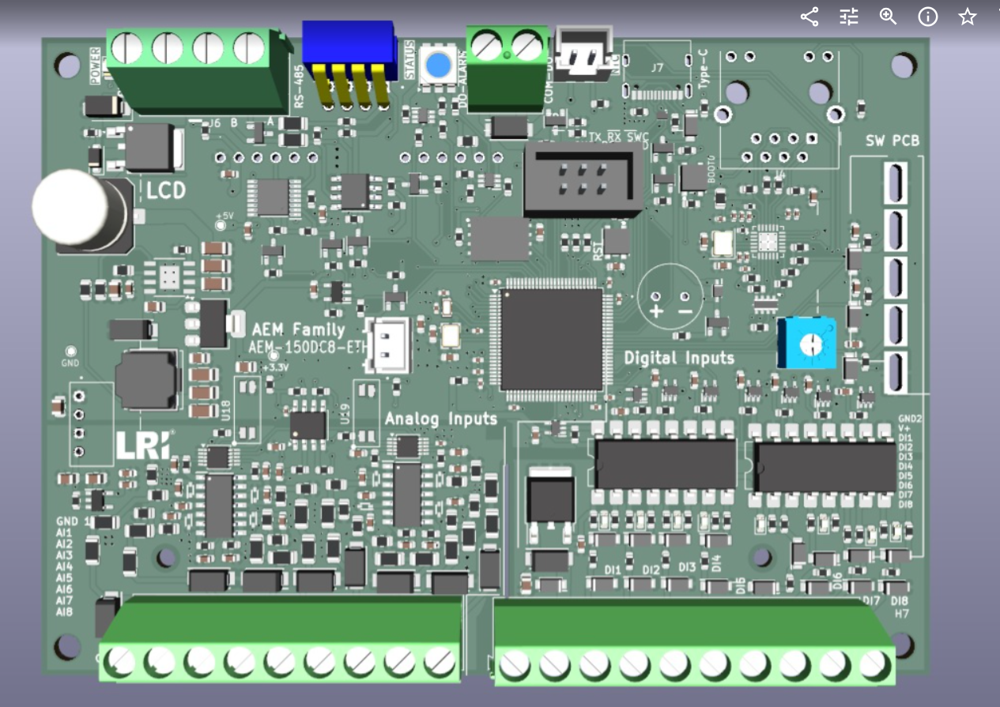

# AEM-150DC8-ETH — SMARK Automation Controller

Industrial automation controller board ("AEM Family") designed for SMARK — a STM32-based I/O controller with Ethernet connectivity and an isolated analog front-end.

## Key features

- **MCU:** STM32F407VETx (ARM Cortex-M4)
- **Ethernet:** LAN8742A PHY + Hanrun HR911105A RJ45 jack, RMII interface (`ETHER_RMII.kicad_sch`)
- **Isolated ADC front-end** (`adc ext.kicad_sch`): ADS1115 16-bit ADC, ISO1540 I2C isolator, RO-0505S isolated DC-DC, LTV-217 optocouplers
- **Signal conditioning:** MCP6004 quad op-amps
- **I/O:** 8× analog inputs (AI1–AI8) and 8× digital inputs (DI1–DI8) on screw terminal blocks
- **Comms & UI:** RS-485 transceiver, 16×4 character LCD, buzzer, status LED
- **Board:** 2-layer, KiCad

## Files

| File | Contents |
|---|---|
| `kicad/AEM-150DC8-ETH Final Rev 1.kicad_pro` | KiCad project — open this |
| `kicad/AEM-150DC8-ETH Final Rev 1.kicad_sch` | Top-level schematic |
| `kicad/AEM-150DC8-ETH Final Rev 1.kicad_pcb` | Board layout |
| `kicad/ETHER_RMII.kicad_sch` | Ethernet PHY hierarchical sheet |
| `kicad/adc ext.kicad_sch` | Isolated external ADC hierarchical sheet |
| `kicad/AEM-150DC8-ETH Final BOM.csv` | Bill of materials |
| `kicad/AEM-150DC8-ETH Final BOM LCSC.csv` | LCSC/JLCPCB assembly BOM |
| `docs/board-3d-render.png` | 3D render of the board |

## Design notes

- Analog and digital sections are partitioned on the layout, with the ADC front-end galvanically isolated from the MCU side.
- The LCSC BOM is set up for JLCPCB assembly (0603 passives throughout).
